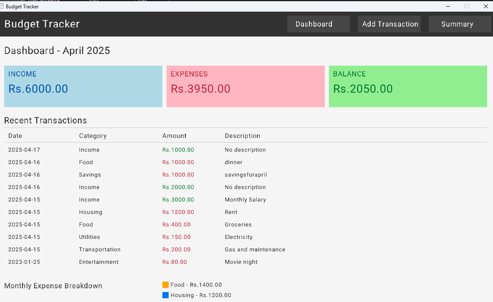
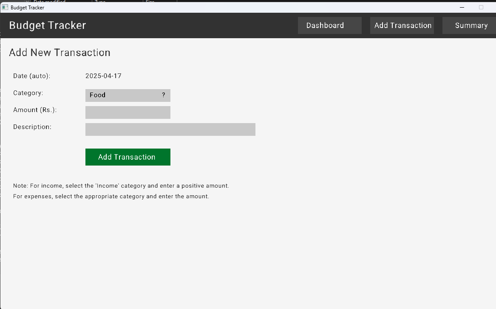

# 💰 Budget Tracker

A **desktop-based personal finance application** built using **C++** and **Raylib** that allows users to track their income and expenses, visualize spending habits, and manage their budget effectively.

---

## 🚀 Features

- 📊 **Dashboard**: Displays monthly income, expenses, and remaining balance along with recent transactions.
- ➕ **Add Transaction**: Easily input new transactions with category selection, amount, and description.
- 📅 **Monthly Summary**: View detailed financial breakdowns and category-wise pie charts for any selected month.
- 📁 **Data Storage**: Transactions are saved persistently in CSV format.
- 🎨 **Visual Insights**: Color-coded categories and pie charts make financial analysis simple and intuitive.

---

## 🛠️ Tech Stack

- **C++** – Core programming logic
- **Raylib** – Lightweight C++ graphics library used to render the UI and charts
- **CSV File Handling** – For saving and loading transaction history
- **Custom Fonts and Colors** – For an enhanced user interface

---

## 👥 Team Members

| Name               | Roll Number   |
|--------------------|---------------|
| Yash Goyal         | 24BAI10100    |
| Aryan Kumar Rai    | 24BAI10151    |

---

## 🔮 Future Scope

- Export monthly reports as PDF
- Add login system with encrypted user data
- Set monthly budget goals and alerts
- Integrate spending predictions using AI/ML
- Build a mobile version with Flutter or React Native

---
## 📷 Screenshots

### 🧭 Dashboard

### ➕ Add Transaction

### 📅 Monthly Summary

---

## 📄 How to Run
> JUST SIMPLY DOWNLOAD THE ZIP FILE OF IT AND EXTRACT IT AND THEN SIMPLY RUN THE "2.exe" FILE 
